## Overview

ezbeq is a web interface that works in conjunction with minidsp-rs, which allows for simplistic selection of a movie / TV show BEQ filter and configuration of a MiniDSP 2x4HD, without having to use the proprietary minidsp plugin. The web interface is usable from phones, tablets, laptops or desktops.

## Pre-Requirements

ezbeq and minidsp-rs run on Linux, Windows, or Mac operating systems, but this document walks through the installation process on Windows 10. The following systems are required to follow this document:

- MiniDSP 2x4HD
- Windows 10 system (this document based on 20H2, fully patched)
- USB cable connecting the Windows device and MiniDSP 2x4HD
- Internet connection
- Backup copy of all MiniDSP 2x4HD settings

NOTE – ezbeq and minidsp-rs will be modifying the INPUT settings of the MiniDSP 2x4HD, but please take appropriate backups.

## Installation Steps

### Install Microsoft Visual Studio Build Tools
Both minidsp-rs and one of the pre-requisites for ezbeq requires the Build Tools to be available, or installation and execution will fail.

1\. Open a browser and go to the Visual Studio downloads site: [https://visualstudio.microsoft.com/downloads/](https://visualstudio.microsoft.com/downloads/)

2\. Click on the "Tools for Visual Studio 2019" section, and click the "Download" button next to "Build Tools for Visual Studio 2019".

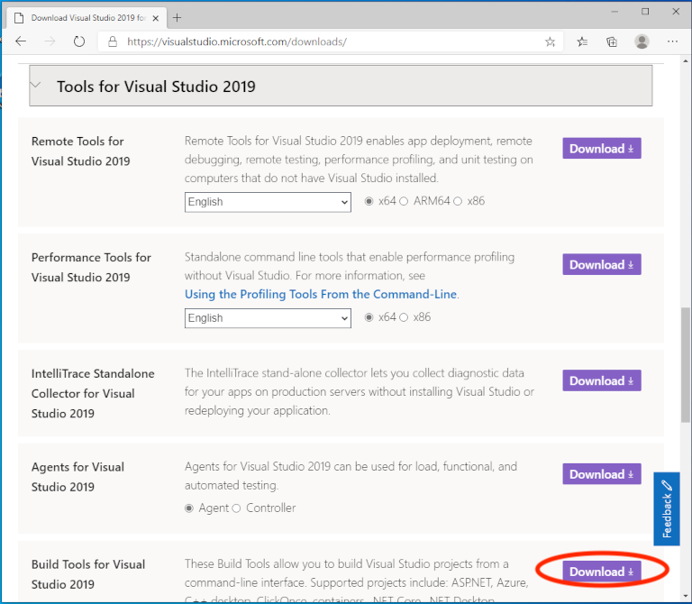

3\. Execute the downloaded file to start the installation. Ensure the box for C++ build tools is checked, and the first 3 boxes on the right side under Optional. Click the Install button.

Note that this downloads approximately 1.6 GB of files for installation, so it may take awhile.

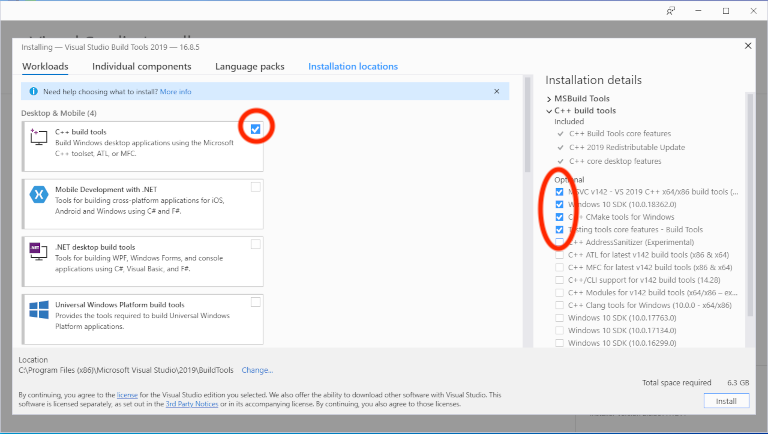

### Install and verify minidsp-rs

minidsp-rs is a utility, written by mrene on avsforum.com, which allows the system to communicate with the MiniDSP 2x4HD, without using the proprietary minidsp plugin. Pre-compiled binaries are available for most operating systems, and there is an available Windows executable.

1\. The minidsp-rs software is in a .tar.gz compressed format, which Windows does not understand natively. Unless a more robust decompression utility is already installed (in which case, skip this step), download and install 7-Zip ([www.7-zip.org](https://www.7-zip.org)), which is a free decompression utility that supports many more formats than the native Windows tools.

2\. Open a browser and go to [https://github.com/mrene/minidsp-rs/releases](https://github.com/mrene/minidsp-rs/releases). Download file minidsp.x86_64-pc-windows-msvc.tar.gz

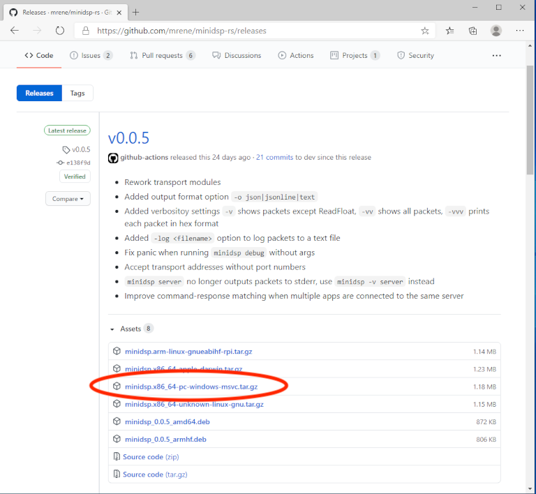

3\. Open the .tar.gz file with 7-Zip. The easiest method is to right click on the file, go to 7-Zip, and select Open archive.

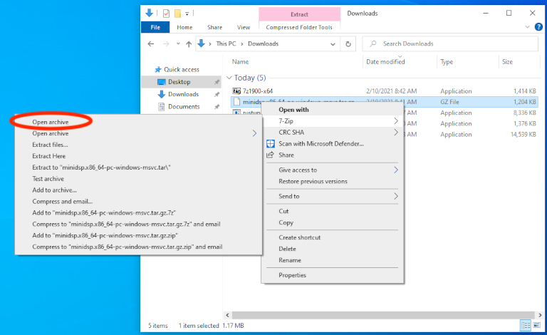

4\. A .tar.gz file is actually 2 containers. The first one (the .gz) is now open in 7-Zip.

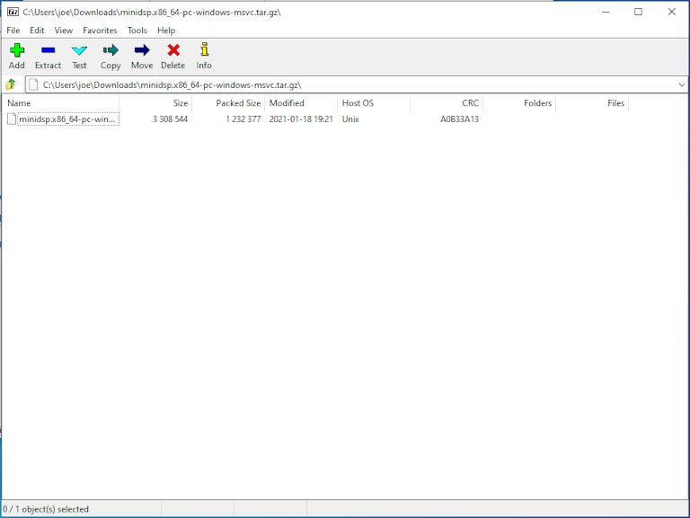

5\. Double-click on the file in the 7-Zip window, to open the .tar file.

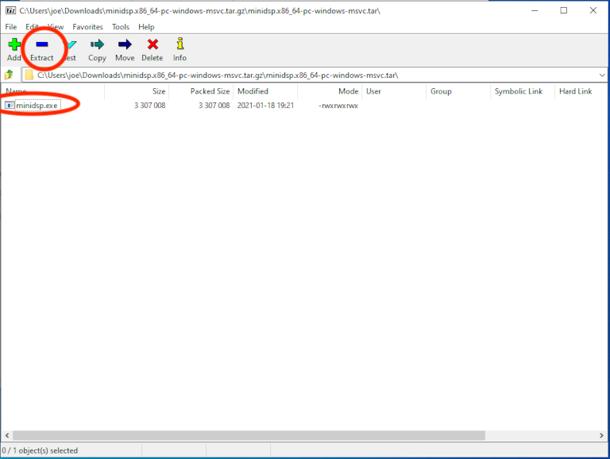

6\. Highlight the minidsp.exe file, and click the Extract icon. Select a location for the file (such as the user's home directory) and make note of it as it will be needed for the ezbeq configuration.

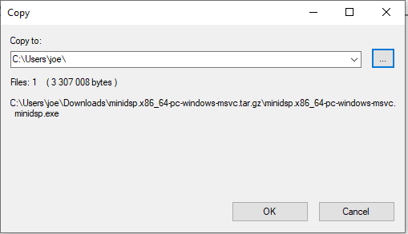

7\. To confirm basic functionality, open a Command Prompt.

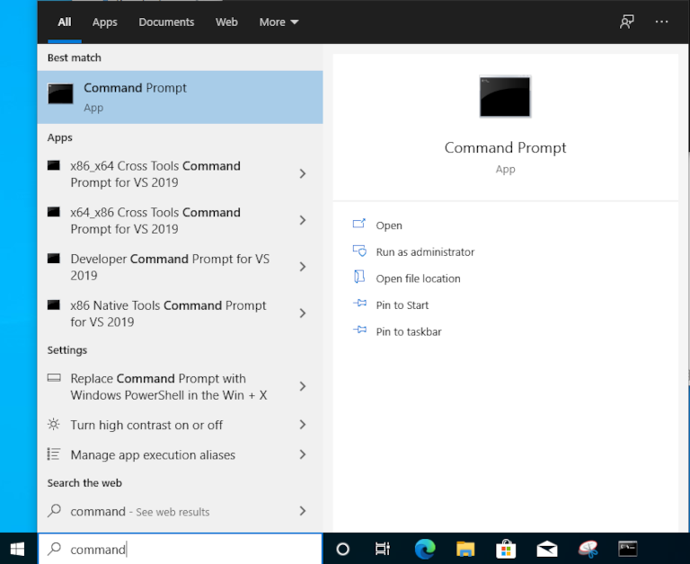

8\. In the Command Prompt window, type: `minidsp`

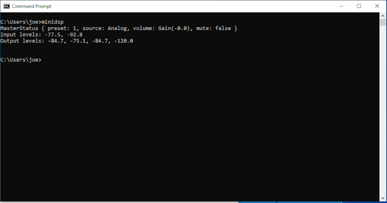

5\. If the MiniDSP 2x4HD is connected properly, similar information to the screenshot above will be displayed. Note the &quot;preset: 1&quot; in the image. That indicates that the MiniDSP 2x4HD is set to Config slot 2. The minidsp-rs application starts at 0 for the config presets, so 0 = Config slot 1, and so on.

6\. If the MiniDSP 2x4HD is not detected, or is not connected, the following error will appear.
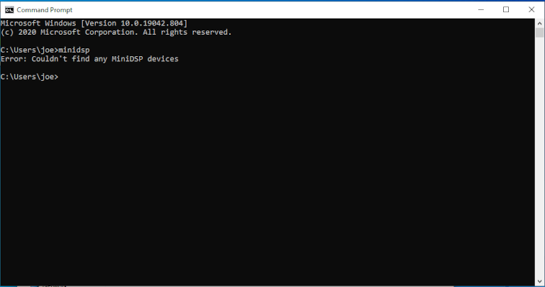

### Install Chocolatey

Chocolatey is a package manager for Windows, which will be used to install Python.

1\. Open a browser and go to [https://chocolatey.org/install](https://chocolatey.org/install)

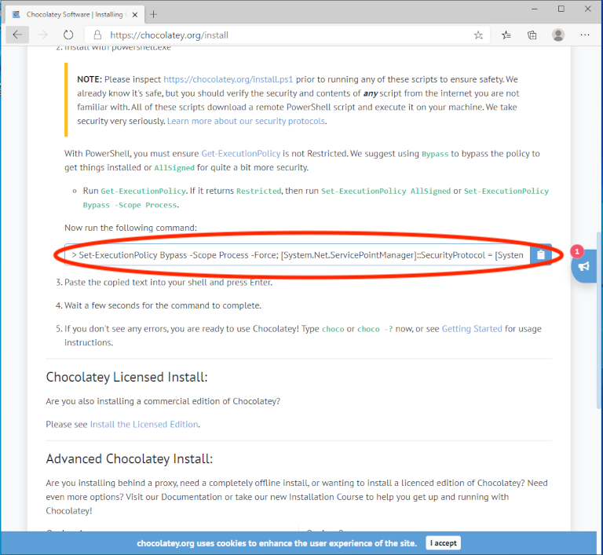

2\. Copy the command in the middle of the page. Heed the warnings about running commands directly from a website. This is not an endorsement of this site, but it is the simplest method of getting Python installed on Windows.

The command (as of 2/10/21) is: `Set-ExecutionPolicy Bypass -Scope Process -Force; [System.Net.ServicePointManager]::SecurityProtocol = [System.Net.ServicePointManager]::SecurityProtocol -bor 3072; iex ((New-Object System.Net.WebClient).DownloadString('https://chocolatey.org/install.ps1'))`

3\. Open a Powershell command with administrative privileges, otherwise the command will not work properly. This is done by finding Powershell from the Start menu, right-clicking on it, and selecting Run with Administrator privileges.

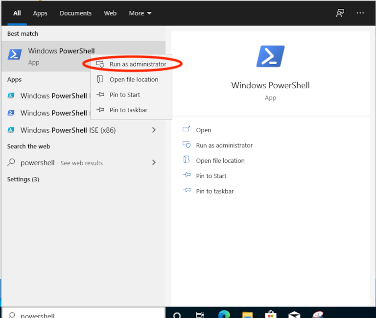

4\. Paste the command above into the Powershell window, and press enter.

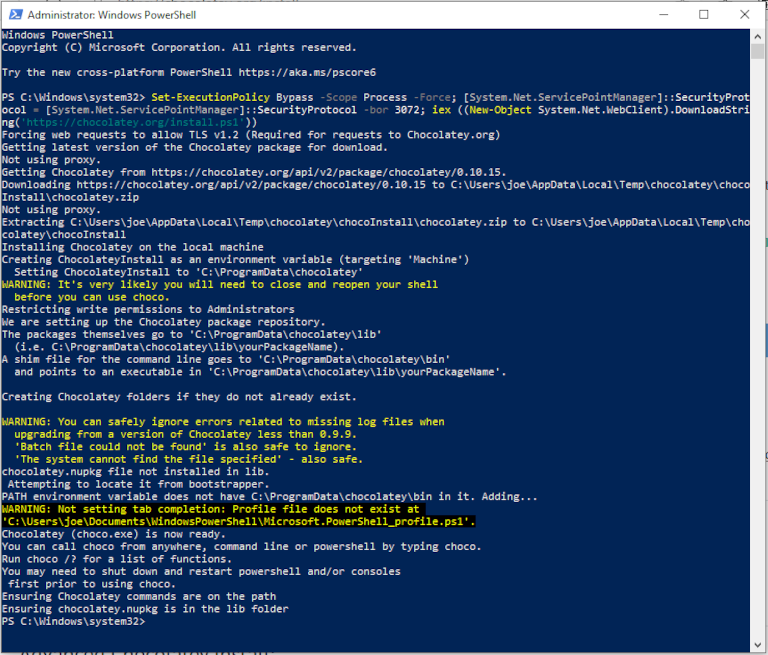

5\. Close the Powershell window

### Install Python

ezbeq is built on Python, so it must be installed next.

1\. Open a new Powershell window with administrative privileges (same process as above) and run the following:
```
cd ~
Set-ExecutionPolicy -Scope CurrentUser
RemoteSigned
y

choco install -y python --version=3.8.0
```

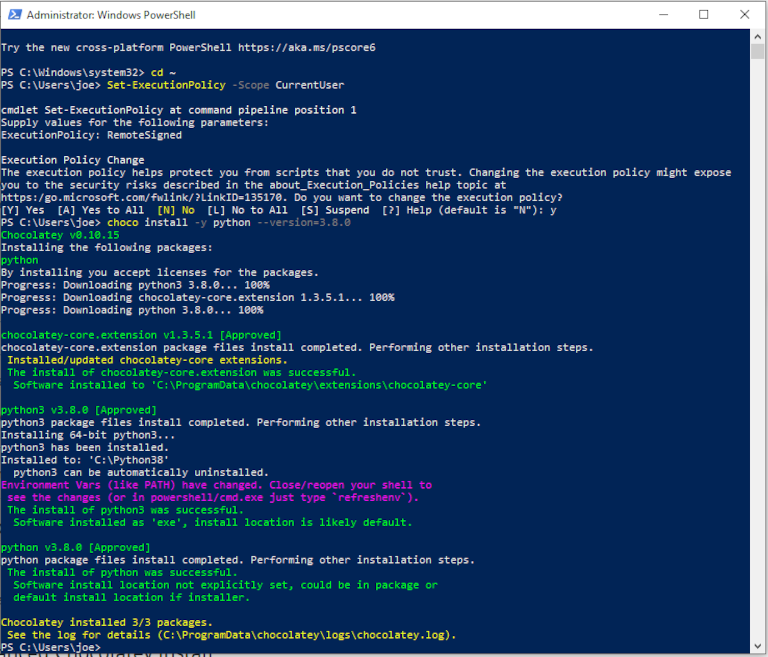

2\. Close the Powershell window

### Install and verify ezbeq
ezbeq is a web application which uses minisdsp-rs installed earlier to send the BEQ filters to an attached MiniDSP 2x4HD. After successfully installing the pre-requisites (minidsp-rs, Chocolatey, Python and Visual Studio Build Tools), ezbeq may be installed.

1\. Open a new Powershell with administrative privileges, just like the previous steps.

2\. Setup the environment and upgrade PIP, otherwise ezbeq installation will fail. PIP will be upgraded twice.
```
cd ~
Set-ExecutionPolicy -Scope CurrentUser
RemoteSigned
y

python -m pip install --upgrade pip
mkdir python
cd python
python -m venv ezbeq
cd ezbeq
.\Scripts\activate
python -m pip install --upgrade pip
```
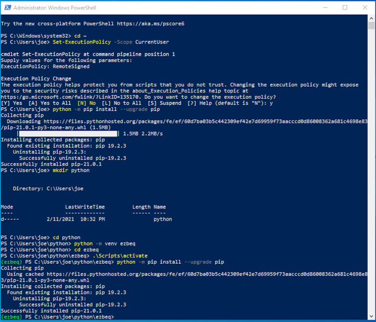

3\. Start the install of the ezbeq application. The required python modules will be installed. Run the following commands:
```
pip install ezbeq
```  
The installer will download and install the required modules. This may take quite a while, depending on the speed of your device and internet connection. The information below is truncated.

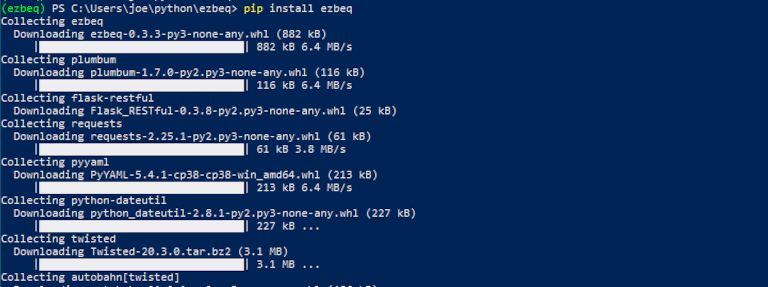

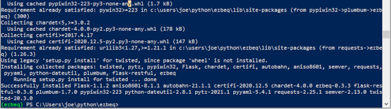

4\. Modifications to the ezbeq configuration are needed, but the config file isn't created until the first time it is run. Launch ezbeq, which will error out, but will create the needed configuration file. In the same Powershell window, type the following:
```
.\Scripts\ezbeq.exe
```
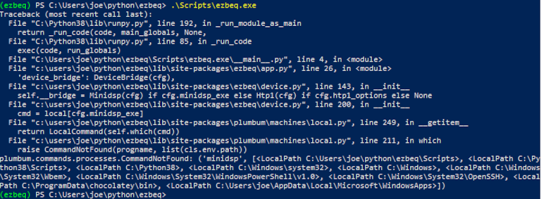

5\. Open Windows Explorer (file manager), navigate to the user home folder, and then double-click on the .ezbeq folder.

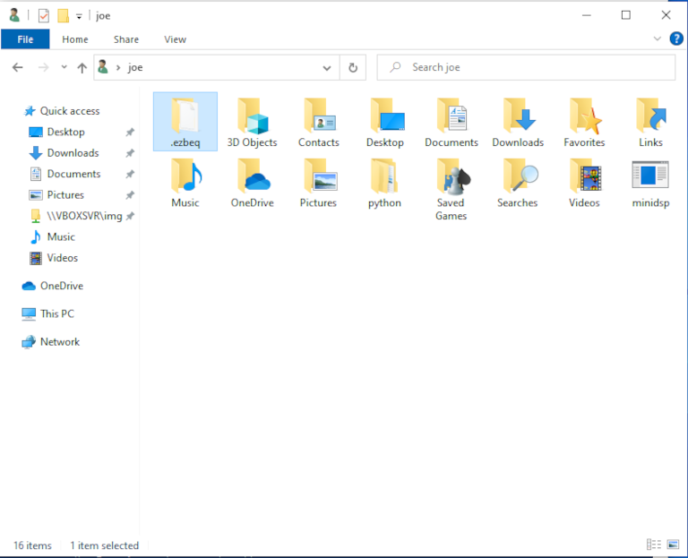

6\. Double-click on the ezbeq.yml file.

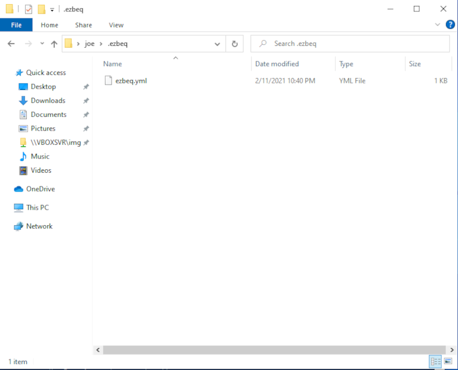

7\. Double-click on the file, choosing Notepad to open the file (or the preferred text editor).

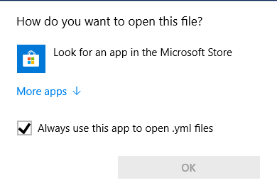

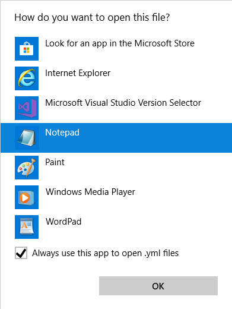

8\. Initial configuration file example

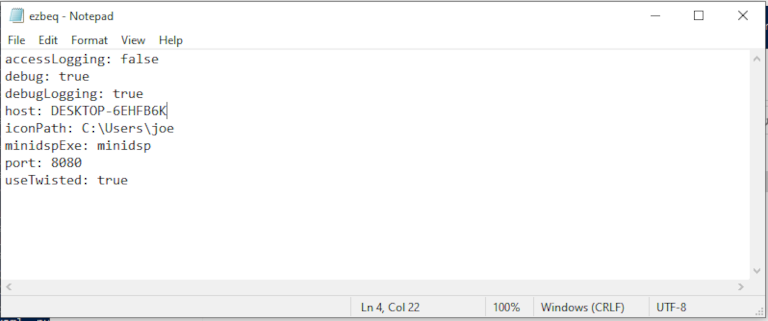

9\. Host will be the name of the system. Change the "minidspExe" line to the location where the minidsp.exe was placed initially. Save the file.

NOTE: Ensure that .exe is added to the end as well, or it won't work correctly.

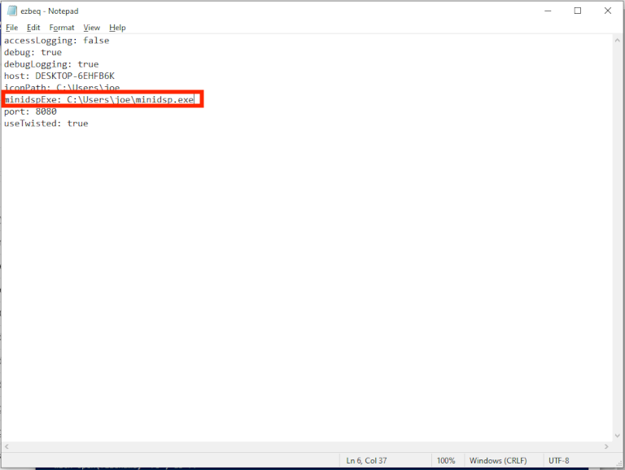

10\. Switch back to the Powershell window, press the up arrow, and restart ezbeq (or type `.\Scripts\ezbeq.exe`). This time it should stay running (the prompt will not return). If it errors again, the mostly reason is that ezbeq cannot find the minidsp executable.

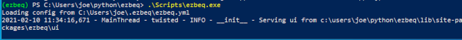

11\. A Windows Defender window may pop up. Select the "Private networks" option. Uncheck the "Public networks". Click on Allow Access.

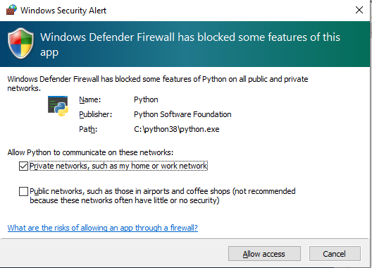

10\. ezbeq runs on port 8080 of the system by default. Open a web browser and connect to the system on port 8080. Note that the web server is not encrypted, so the URL must be entered as http, otherwise most current browsers will automatically try to connect using HTTPS (secured) and fail.

Open a browser window to `http://127.0.0.1:8080`

(127.0.0.1 is a special reference to the local machine. If the server running ezbeq is remote, enter the IP of it instead of 127.0.0.1.)

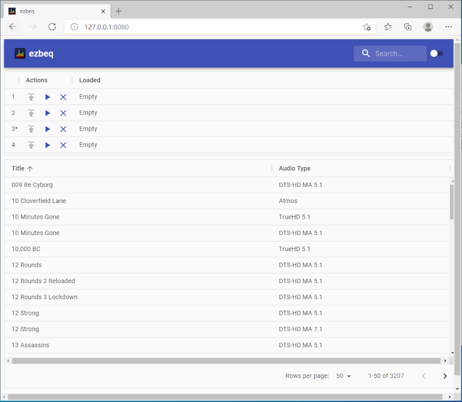

11\. To load a BEQ onto the MiniDSP 2x4HD, select a title (search is available in the upper right corner), then click on the &quot;up arrow&quot; on the corresponding config slot to be used.

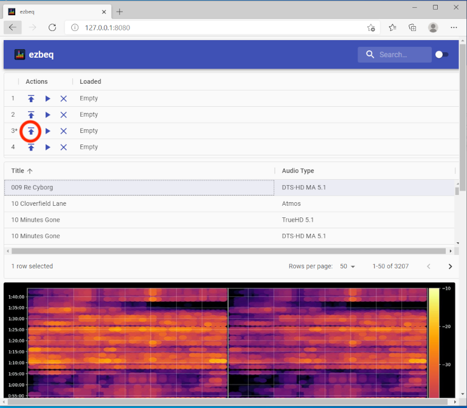

13\. If the update is successful, the title will be display in the &quot;Loaded&quot; column. Otherwise, &quot;ERROR&quot; will be displayed.


### Automatically launch ezbeq on boot

These steps are optional but are highly recommended. If these steps are not followed, ezbeq will need to be started manually after every reboot of the Windows device, or if the Powershell window is closed.

1\. Open Task Scheduler


2\. Click on Create Task...

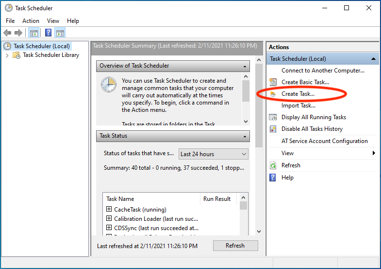

3\. Enter the name for the task (such as "ezbeq"), and select the "Run whether user is logged on or not" option.

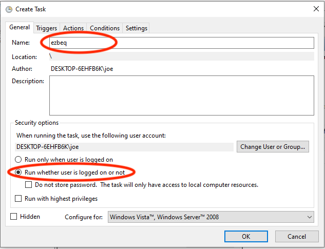

4\. Click on the Triggers tab. Click "New..." button. Select "At startup" from the drop down list, click OK.

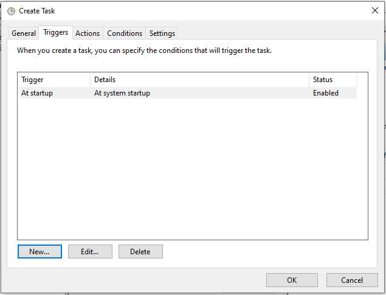

5\. Click on the Actions tab. Click "New..." button. In the Program/script field, enter the full path to the ezbeq.exe file, or navigate through the folders by clicking the "Browse..." button. Then click OK.

If it has been installed following these directions, the path should be: `C:\Users\<userid>\python\Scripts\ezbeq.exe` (replacing <userID> with the correct ID).

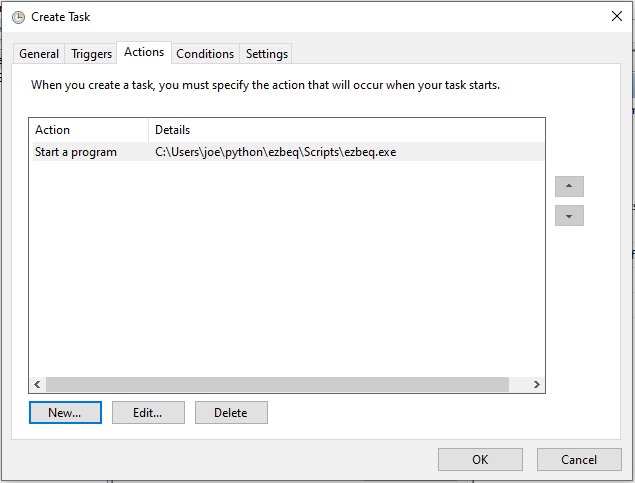

6\.Click OK, which then prompts for the user's password. This should be the password for the account under which the application has been installed.

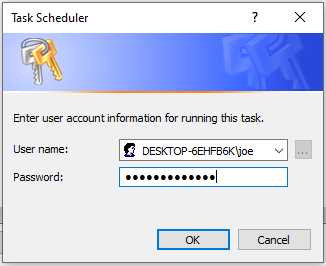

7\. The main Task Scheduler should appear, and the new task should be visible.

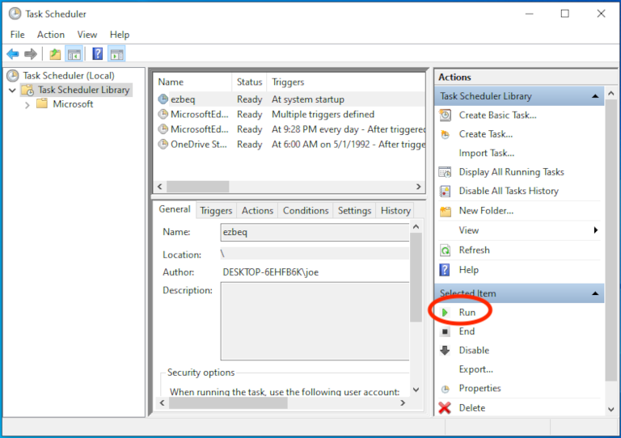

8\. Reboot the Windows device to find out if the service restarts properly, or highlight the ezbeq task, and click the "Run" icon to start it right away.

NOTE - If ezbeq is still running in a Powershell window, please stop it before attempting to run the task, or it will error out.

### Updating minidsp-rs

Updating minidsp-rs is the exact same process as above, with a new version of the file. Save a backup copy of the currently used version, then download, decompress, and place it in the same location as the old version (overwriting the old one).

v0.0.5 of minidsp-rs appears to be "feature complete" regarding the pieces required to work with ezbeq, and is stable. As of 2/12/2021, there is no reason to upgrade.

### Updating ezbeq

Updating ezbeq is also extremely similar to the initial installation process, with a slight tweak to the install command in step #3 below.

1\. If ezbeq is running, it needs to be stopped or else the upgrade will fail. If it is running manually in a Powershell window, Ctrl-C to stop it, and then close the Powershell window. Skip to step #XX.

2\. If ezbeq was set to run automatically on boot, open Task Scheduler and select "Display All Running Tasks".

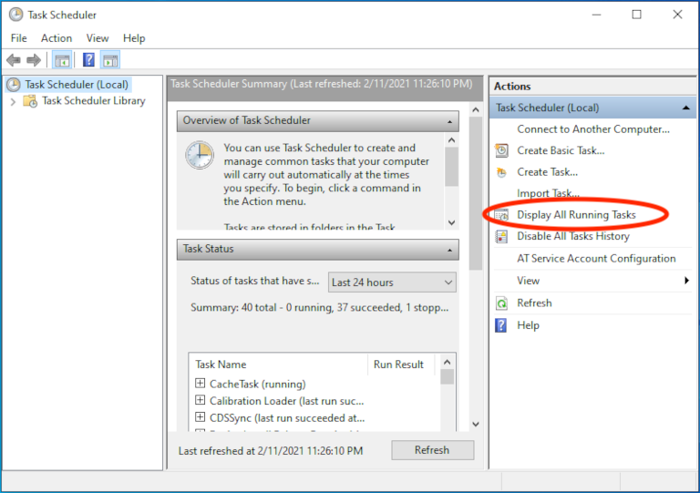

3\. Select ezbeq and click "End Task".

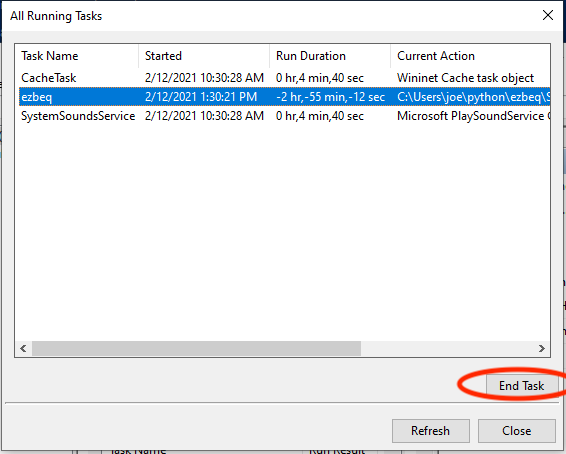

4\. Select "Yes" to end the selected task.


5\. Verify the ezbeq task is no longer listed, and close task scheduler windows.

6\. Open a new Powershell with administrative privileges, just like the previous steps.

7\. Setup the environment and ensure PIP is up to date, otherwise ezbeq installation may fail. 

```
cd ~
Set-ExecutionPolicy -Scope CurrentUser
RemoteSigned
y

cd python
cd ezbeq
.\Scripts\activate
python -m pip install --upgrade pip
```
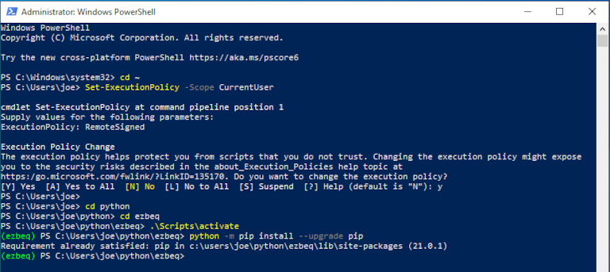

8\. Start the upgrade of the ezbeq application. Python modules will be re-installed. Run the following commands:
```
pip install --upgrade --force-reinstall ezbeq
```  
The installer will download and install the required modules. This may take quite a while, depending on the speed of your device and internet connection. The information below is truncated.

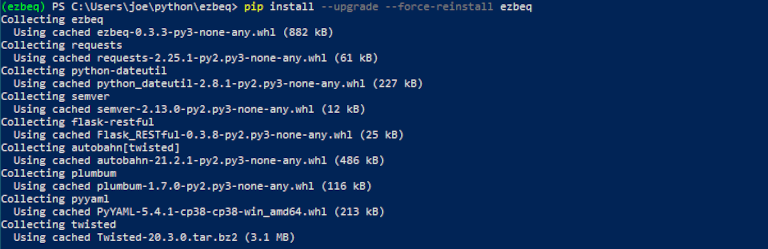
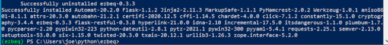

9\. Launch ezbeq as above (`.\Scripts\ezbeq.exe`), or if it is configured to launch on boot, reboot the device.

### A few other notes.

Bear in mind that, so far, settings cannot be read back from the MiniDSP 2x4HD. This means that no applications are able to show your currently loaded configs, including the official plugin. The official plugin handles this by detecting a change to the local data and forcing that down to the MiniDSP. It may be worth periodically reloading any custom EQ&#39;s on all output channels and clearing all inputs.
