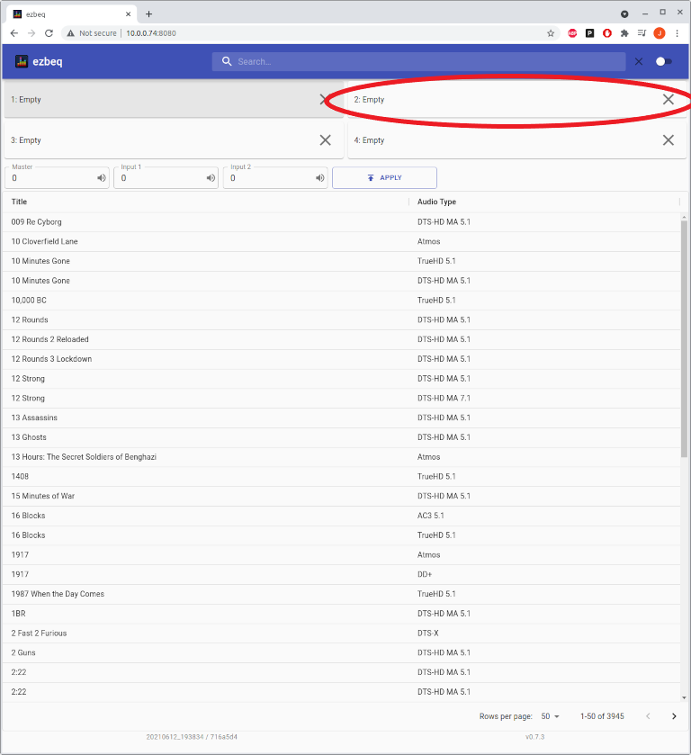
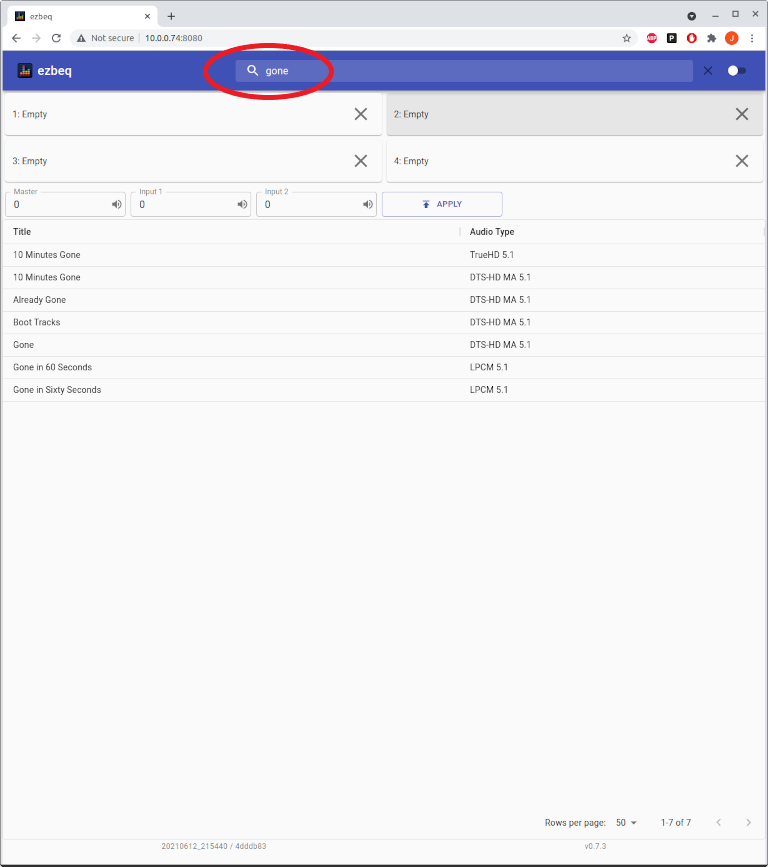

## Overview

ezbeq is a web interface which allows for simplistic selection of a movie / TV show BEQ filter to load into a MiniDSP 2x4HD, an HTP-1, or JRiver Media Center solution. It was originally developed for use with MiniDSP 2x4HD hardware (in conjunction with a tool called minidsp-rs) without having to use the proprietary minidsp plugin, but has expanded to include several other solutions, as well as an API layer for futher extensibility.

The web interface is usable from phones, tablets, laptops or desktops.

## Pre-Requirements

ezbeq and minidsp-rs run on Linux, Windows, or Mac operating systems. Basic instructions are provided for installation and setup on Raspberry Pi (running RaspberryOS/raspbian) and Windows. The RPi documentation may also be used on an x86 machine running a Debian-based linux distribution (Debian, Ubuntu, Mint, etc), with some slight tweaks.

The following requirements should be met before attempting an installation:

### MiniDSP:
- Functional and supported MiniDSP 
  - the [2x4HD](https://www.minidsp.com/products/minidsp-in-a-box/minidsp-2x4-hd) is the default supported device however most devices supported by minidsp-rs are supported by ezbeq
  - refer to the [ezbeq docs](https://github.com/3ll3d00d/ezbeq/#minidsp-variants) for information on how to configure ezbeq for use with other Minidsp models
- Windows or Linux based system (Raspberry Pi) with network connectivity
- USB cable connecting the computing system to the MiniDSP 2x4HD
- Internet connection
- Backup copy of all MiniDSP 2x4HD settings.

NOTE – ezbeq and minidsp-rs will be modifying the INPUT settings of the MiniDSP 2x4HD, but please take appropriate backups.

### HTP-1:
- Functional HTP-1 ([https://www.monoprice.com/product?p_id=37887](https://www.monoprice.com/product?p_id=37887))
- Windows or Linux based system (Raspberry Pi) with network connectivity
- Network connectivity from ezbeq server to HTP-1
- Internet connection

### JRiver Media Center:
- Functional Jriver Media Center installation version MC28 ([https://jriver.com](https://jriver.com))
- Windows or Linux based system (Raspberry Pi) with network connectivity
- Network connectivity from ezbeq server to Jriver installation
- Internet connection

## Suggested interaction of ezbeq and official MiniDSP plugin

- Neither ezbeq/minidsp-rs or the official plugin are able to read the configuration from the MiniDSP 2x4HD
- If changes are made with ezbeq, the next time the official plugin is loaded, it will want to initialize or load from a backup, because it detects a change (but doesn't know what is).
- When using ezbeq, there is no need to merge the BEQ with any applicable house curve.

1\. Use the official plugin to set an initial configuration, including enabling input to output routing, output gain, delay, and filters. House curves should be loaded on the outputs.

2\. Save this initial configuration, in case it needs to be loaded in the future.

3\. Use ezbeq to load BEQ's on the inputs. The output configurations will not be touched.

## Installation

Follow one of the two guides provided (Windows or RPi).

## Usage

### Initial Screen

The box for the active slot will be highlighted (and also shows that ezbeq + minidsp-rs is working properly). If none of the slots are highlighted, this indicates that ezbeq cannot communicate with the MiniDSP 2x4HD.

### Activate a config slot

Click on the box corresponding to the number of the config slot to be activated.

If successful, the corresponding box will now be highlighted.

### Search

To search for a title, type a portion of the name into the search field at the top of the page. Matching titles will be listed automatically.

### Load a BEQ

Select a title from the list, which will then populate the lower portion of the page. Information about the title is displayed, the author of the BEQ, volume adjustments, and the BEQ graphs. Select the config slot to use (the currently active slot will be selected by default), and click on UPLOAD.

If the BEQ loaded correctly, the title will be listed in the Loaded column, and the * will show the config slot is active.

### Clear a BEQ

To clear a config slot, click on the "X" for the appropriate slot.

If the clearing process was successful, the Loaded column will now display "Empty".

### Input Gain

Some BEQ filters contain input gain suggestions. If the BEQ has applicable input gain options, the "Set Input Gain" box will be available to be selected (it is unchecked by default). If the filter does not contain actionable input gain settings, this option will be grayed out.

This title does not have input gain settings available, and therefore is grayed out.

### Main Volume

The main volume (MV) of the MiniDSP can be controlled via ezbeq.
* 0 is the highest MV can go. Entries can only be negative.
* 0.5 steps, (example: -0.5, -1.0, -1.5)
* -127 is the lowest value MiniDSP supports.

To change the volume, enter a new value and press the APPLY button. 

### Input 1 and Input 2 Gain

The gain on Input 1 and Input 2 may be set separately (and may be different)
* 12 is the maximum gain supported on the inputs
* -72 is the minimum gain supported on the inputs
* 0.25 step values (examples: 1.25, 1.5, -12.5)

To change the gain, enter a new value in Input 1 and/or Input 2 box, and press the APPLY button.

### Muting

ezbeq allows you to quickly mute the overall MiniDSP, Input 1, or Input 2.

To mute the main or inputs, press on the speaker icon in the respective box, and press the APPLY button.

