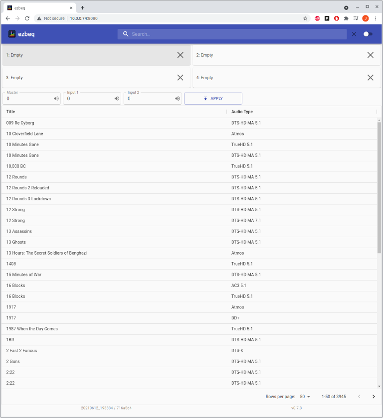
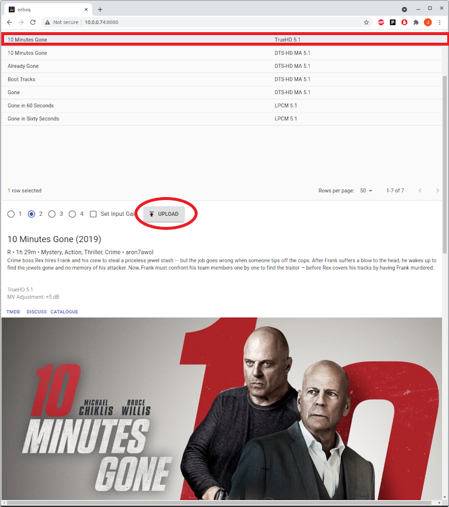
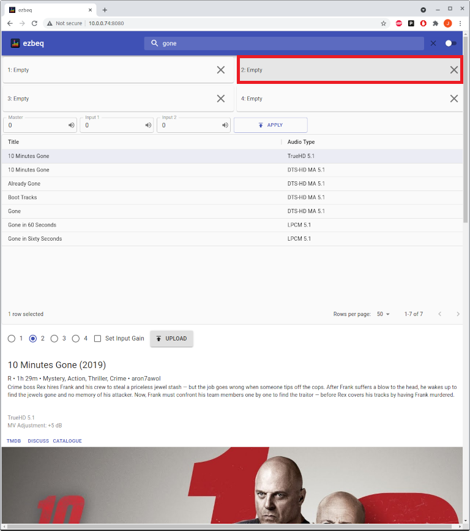

## Overview

ezbeq is a web interface that works in conjunction with minidsp-rs, which allows for simplistic selection of a movie / TV show BEQ filter and configuration of a MiniDSP 2x4HD, without having to use the proprietary minidsp plugin. The web interface is usable from phones, tablets, laptops or desktops.

## Pre-Requirements

ezbeq and minidsp-rs run on Linux, Windows, or Mac operating systems. Basic instructions are provided for installation and setup on Raspberry Pi (running RaspberryOS/raspbian) and Windows. The RPi documentation may also be used on an x86 machine running a Debian-based linux distribution (Debian, Ubuntu, Mint, etc).

The following requirements should be met before attempting an installation:

- Functional MiniDSP 2x4HD ([https://www.minidsp.com/products/minidsp-in-a-box/minidsp-2x4-hd](https://www.minidsp.com/products/minidsp-in-a-box/minidsp-2x4-hd))
- Windows or Linux based system (Raspberry Pi) with network connectivity
- USB cable connecting the computing system to the MiniDSP 2x4HD
- Internet connection
- Backup copy of all MiniDSP 2x4HD settings.

NOTE – ezbeq and minidsp-rs will be modifying the INPUT settings of the MiniDSP 2x4HD, but please take appropriate backups.

## Suggested interaction of ezbeq and official MiniDPS plugin

- Neither ezbeq/minidsp-rs or the official plugin are able to read the configuration from the MiniDSP 2x4HD
- If changes are made with ezbeq, the next time the official plugin is loaded, it will want to initialize or load from a backup, because it detects a change (but doesn't know what is).
- When using ezbeq, there is no need to merge the BEQ with any applicable house curve.

1\. Use the official plugin to set an initial configuration, including enabling input to output routing, output gain, delay, and filters. House curves should be loaded on the outputs.

2\. Save this initial configuration, in case it needs to be loaded in the future.

3\. Use ezbeq to load BEQ's on the inputs. The output configurations will not be touched.

## Installation

Follow one of the two guides provided (Windows or RPi).

## Usage

### Initial Screen

- The * next to a config slot indicates that slot is active (and also shows that ezbeq + minidsp-rs is working properly). If no * is present, then there is a problem talking to the MiniDSP 2x4HD.

### Activate a config slot

Click the play icon next to a slot number to change to that configuration slot. This will not make any changes to the BEQ loaded, just switches to a configuration slot.

If successful, the * will now denote the newly active config slot.

### Search

To search for a title, type a portion of the name into the search field in the upper right corner. The listed titles will automatically change to match the search parameters.

### Load a BEQ

Select a title from the list, and then click the Up arrow on the slot to which the BEQ should be loaded. If the chosen slot is different than the currently active slot, ezbeq will make the requested slot active, and then load the BEQ.

If the BEQ loaded correctly, the title will be listed in the Loaded column, and the * will show the config slot is active.

### Clear a BEQ

To clear a config slot, click on the "X" for the appropriate slot.

If the clearing process was successful, the Loaded column will now display "Empty".

