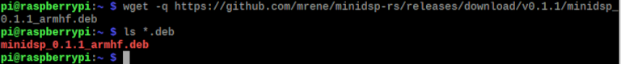
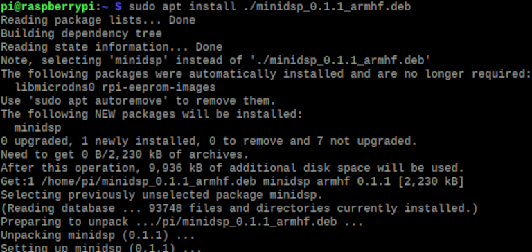
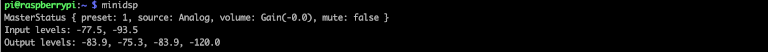
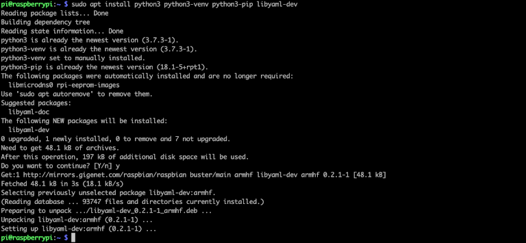
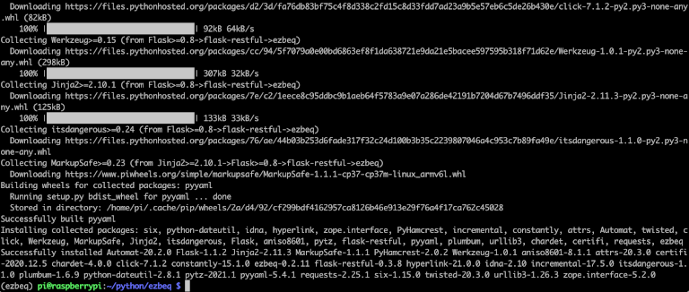
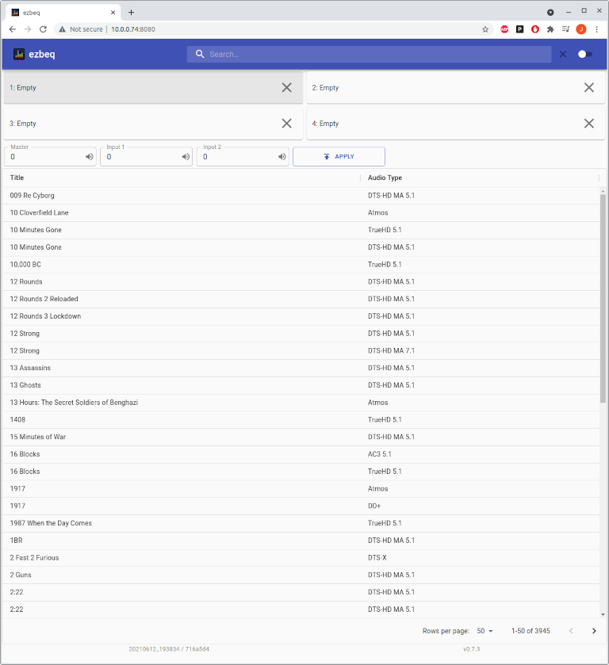
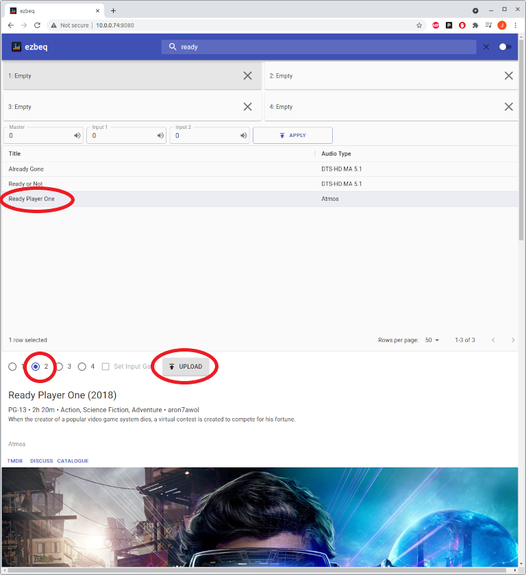
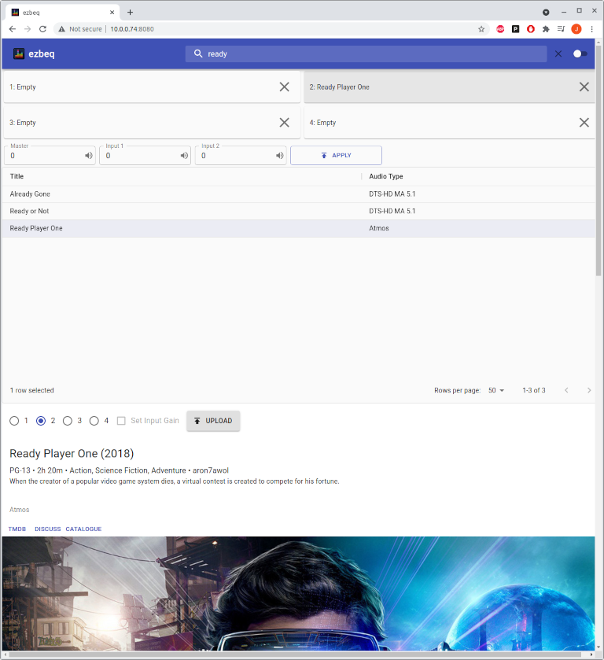
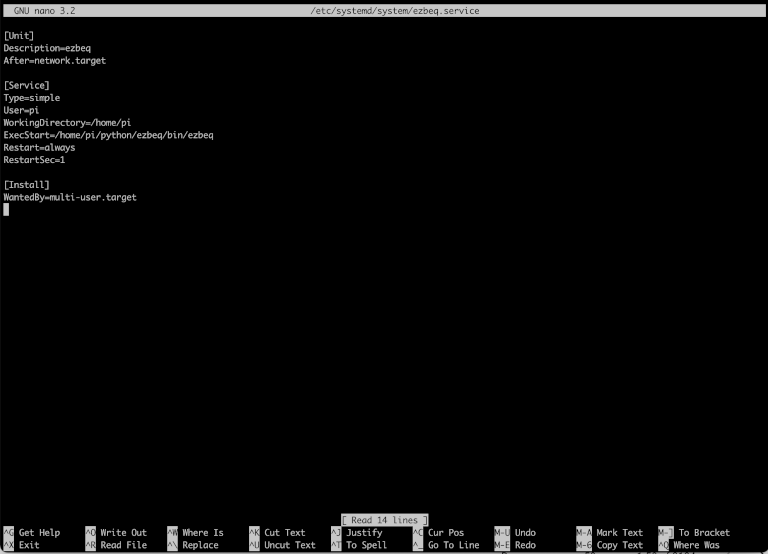
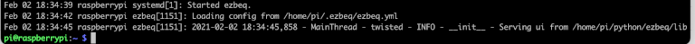

## Overview

ezbeq is a web interface that works in conjunction with minidsp-rs, which allows for simplistic selection of a movie / TV show BEQ filter and configuration of a MiniDSP 2x4HD, without having to use the proprietary minidsp plugin. The web interface is usable from phones, tablets, laptops or desktops.

## Pre-Requirements

ezbeq and minidsp-rs run on Linux, Windows, or Mac operating systems, but this document walks through the installation process on a Raspberry Pi. The following systems are required to follow this document:

- MiniDSP 2x4HD
- Raspberry Pi (RPi) – device should be accessible on the network, and already have Raspbian installed and updated. Raspbian Buster is used for this document.
- USB cable connecting the Raspberry Pi and MiniDSP 2x4HD
- Internet connection
- Backup copy of all MiniDSP 2x4HD settings.
- Static IP configured on the RPi (DHCP can be used, but the IP address of the RPi may change at some point)

NOTE – ezbeq and minidsp-rs will be modifying the INPUT settings of the MiniDSP 2x4HD, but please take appropriate backups.

## Installation Steps

### Install and verify minidsp-rs

minidsp-rs is a utility, written by mrene on avsforum.com, which allows the system to communicate with the MiniDSP 2x4HD, without using the proprietary minidsp plugin. Pre-compiled binaries are available for most operating systems, and there is an available Debian package.

1\. Open a shell on the RPi, or SSH to the RPi.

2\. Download the latest version of minidsp-rs for Arm from [here](https://github.com/mrene/minidsp-rs/releases)
``` 
wget https://github.com/mrene/minidsp-rs/releases/download/v0.0.5/minidsp_0.0.5_armhf.deb
```
Note that the filename above is current as of 2/2/2021. Please use the current version.


3\. Install the downloaded .deb file via `sudo apt install </path/to/file>`
```
sudo apt install ./minidsp_0.0.5_armhf.deb
```


4\. To confirm basic functionality, type `minidsp` and press Enter.


5\. If the MiniDSP 2x4HD is connected properly, similar information to Figure 3 will be displayed. Note the &quot;preset: 1&quot; in the image. That indicates that the MiniDSP 2x4HD is set to Config slot 2. The minidsp-rs application starts at 0 for the config presets, so 0 = Config slot 1, and so on.

6\. If the MiniDSP 2x4HD is not detected, or is not connected, the following error will appear.


### Install and verify ezbeq

ezbeq is a web application which uses minisdsp-rs installed earlier to send the BEQ filters to an attached MiniDSP 2x4HD. The following steps walk through installing ezbeq.

1\. Open a shell on the RPi, or SSH to the RPi.
Install the pre-requisite python packages. Raspbian Buster had all but one needed package already installed. Run this command to install all of them (already installed packages will be skipped): 
```
sudo apt install python3 python3-venv python3-pip libyaml-dev
```


2\. Setup the python environment by running the follow commands:
```
mkdir python
cd python
python3 -m venv ezbeq
cd ezbeq
```


3\. Start the install of the ezbeq application. The required python modules will be installed. Run the following commands:
```
. bin/activate
pip install ezbeq
```  


The installer will download and install the required modules. This may take quite a while, depending on the speed of your RPi and internet connection. The information below is truncated.



4\. Launch ezbeq manually, to verify functionality. Type the following:
```
    cd bin
    ./ezbeq
```


5\. ezbeq runs on port 8080 of the RPi by default. On another device connected to the local network, open a web browser and connect to the RPi port 8080. Note that the web server is not encrypted, so the URL must be entered as http, otherwise most current browsers will automatically try to connect using HTTPS (secured) and fail.
Open a browser window to `http://<ip address of Rpi>:8080`


6\. To load a BEQ onto the MiniDSP 2x4HD, select a title (search is available in the upper right corner), then click on the &quot;up arrow&quot; on the corresponding config slot to be used.


7\. If the update is successful, the title will be display in the &quot;Loaded&quot; column. Otherwise, &quot;ERROR&quot; will be displayed.


### Automatically launch ezbeq on boot

These steps are optional but are highly recommended. If these steps are not followed, ezbeq will need to be started manually after every reboot of the RPi.

1\. Open a shell on the RPi, or SSH into the RPi.

2\. Create the service file, issuing the following command:
```
sudo nano /etc/systemd/system/ezbeq.service
```


3\. Add the information below to the file. When complete, save the file and exit. To save, press Ctrl-O, which will prompt for a name of the file, press enter to accept the default, then Ctrl-X to exit the editor.

NOTE – If the ezbeq software was installed using a different user than &quot;pi&quot;, ensure to modify the settings below, replacing &quot;pi&quot; with the correct userID.
```
[Unit]
Description=ezbeq
After=network.target
    
[Service]
Type=simple
User=pi
WorkingDirectory=/home/pi
ExecStart=/home/pi/python/ezbeq/bin/ezbeq
Restart=always
RestartSec=1

[Install]
WantedBy=multi-user.target
```


4\. Register and start the service. Note that if ezbeq is still running from the earlier steps, it needs to be stopped (Ctrl-C), otherwise the service will not start.
```
sudo systemctl enable ezbeq.service
sudo service ezbeq start
```


5\. Verify the service started by issuing this command:
```
sudo journalctl -u ezbeq.service
```


6\. Reboot the RPi, and then check the website again.
```
sudo shutdown -r now
```

### Updating minidsp-rs

Updating minidsp-rs is the same process outline in section I above.

1\. Open a shell on the RPi, either locally, or via SSH.

2\. Download the latest Arm .deb package from [https://github.com/mrene/minidsp-rs/releases](https://github.com/mrene/minidsp-rs/releases)
Example: `wget https://github.com/mrene/minidsp-rs/releases/download/v0.0.5/minidsp_0.0.5_armhf.deb`

3\. Install the .deb package using the following command: `sudo apt install ./<filename>`
Example: `sudo apt install ./minidsp_0.0.5_armhf.deb`

### Updating ezbeq

Updating ezbeq follows a similar approach as the initial install, with an extra flag.

1\. Open a shell on the RPi, either locally, or via SSH.

2\. Run the following commands:
```
cd python
cd ezbeq
. bin/activate
pip install --upgrade ezbeq
```

3\. If ezbeq is configured to run on boot (section III), restart the ezbeq service to ensure the update takes effect:
```
sudo service ezbeq restart
```

## Which Raspberry Pi should I buy?

This question has been asked a few times. The biggest key to a successful Raspberry Pi implementation is a solid power supply.

For North American users, kits from CanaKit ([https://canakit.com](https://canakit.com)) have been recommended by some users. Note that this is not an endorsement of their product, nor is there any affiliation with this company.

The software has been run on Pi3 successfully, and should also run on Pi4.

## A few other notes.

Bear in mind that, so far, settings cannot be read back from the MiniDSP 2x4HD. This means that no applications are able to show your currently loaded configs, including the official plugin. The official plugin handles this by detecting a change to the local data and forcing that down to the MiniDSP. It may be worth periodically reloading any custom EQ&#39;s on all output channels and clearing all inputs.
