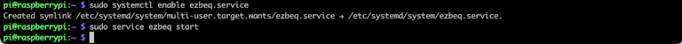

## Overview

ezbeq is a web interface that works in conjunction with minidsp-rs, which allows for simplistic selection of a movie / TV show BEQ filter and configuration of a MiniDSP 2x4HD, without having to use the proprietary minidsp plugin. The web interface is usable from phones, tablets, laptops or desktops.

## Pre-Requirements

ezbeq and minidsp-rs run on Linux, Windows, or Mac operating systems, but this document walks through the installation process on a Raspberry Pi. The following systems are required to follow this document:

- MiniDSP 2x4HD
- Raspberry Pi (rpi) – device have RaspberryPi OS installed, functioning correctly and must tbe accessible on the network via a known IP address. Make note of whether the 64 or 32bit OS has been installed.
- TV/Monitor/AVR with HDMI input and keyboard OR SSH connection to the Raspberry Pi
- USB cable connecting the Raspberry Pi and MiniDSP 2x4HD
- Internet connection
- Backup copy of all MiniDSP 2x4HD settings.
- Static IP or DHCP reservation for the RPi (DHCP can be used, but the IP address of the RPi may change at some point)

NOTE – ezbeq and minidsp-rs will be modifying the INPUT settings of the MiniDSP 2x4HD, but please take appropriate backups.

## Installation Steps

### Install and verify minidsp-rs

minidsp-rs is a utility, written by mrene on avsforum.com, which allows the system to communicate with the MiniDSP 2x4HD, without using the proprietary minidsp plugin. Pre-compiled binaries are available for most operating systems, and there is an available Debian package.

This document is based on minidsp-rs v0.1.9.

1\. Open a shell on the RPi, or SSH to the RPi.

2\. Download the latest stable version (not a "pre" release) of minidsp-rs for Arm from [here](https://github.com/mrene/minidsp-rs/releases). Use the file URL with the "wget" command below to download the file. If using a 32bit OS, the filename will be in the form of "minidsp_version_armhf.deb". If using a 64bit OS, the filename will be in the form of "minidsp_version_arm64.deb". 
``` 
wget https://github.com/mrene/minidsp-rs/releases/download/<version>/<filename>
```


3\. Install the downloaded .deb file via `sudo apt install </path/to/file>`
```
sudo apt install ./<filename>
```


4\. To confirm basic functionality, type `minidsp` and press Enter.


If the command errors and just prints `Floating point exception`, it's likely the armhf package has been installed on a 64bit OS. Download and install the arm64.deb instead.

5\. If the MiniDSP 2x4HD is connected properly, similar information to Figure 3 will be displayed. Note the &quot;preset: 1&quot; in the image. That indicates that the MiniDSP 2x4HD is set to Config slot 2. The minidsp-rs application starts at 0 for the config presets, so 0 = Config slot 1, and so on.

6\. If the MiniDSP 2x4HD is not detected, or is not connected, the following error will appear.


7\. v0.1.0 and greater of minidsp-rs for Debian is automatically configured to run as a daemon (service) and will start automatically after installation and upon bootup. This is a change from the older versions.

8\. IMPORTANT - If you want to use the official MiniDSP plugin for Windows, Mac, iOS, or Android, you will need to edit the configuration file for minidsp-rs to allow it to be accessed from other devices. If you have no desire to do this, you may skip this step and go to the ezbeq installation portion.

Edit the configuration file (/etc/minidsp/config.toml), find the line `bind_address = "127.0.0.1:5333"`, and change it to `bind_address = "0.0.0.0:5333"`. Save the file and restart minidsp-rs. Below is a single command to edit the file. You may also use a text editor like Nano or Pico to do the same thing.

```
sudo sed -i 's/^bind_address = "127\.0\.0\.1:5333"/bind_address = "0\.0\.0\.0:5333"/' /etc/minidsp/config.toml
sudo systemctl restart minidsp
```


### Install and verify ezbeq

ezbeq is a web application which uses minisdsp-rs installed earlier to send the BEQ filters to an attached MiniDSP 2x4HD. The following steps walk through installing ezbeq.

1\. Open a shell on the RPi, or SSH to the RPi.
Install the pre-requisite python packages. Raspbian Buster had all but one needed package already installed. Run this command to install all of them (already installed packages will be skipped): 
```
sudo apt install python3 python3-venv python3-pip libyaml-dev
```


2\. Setup the python environment by running the follow commands:
```
mkdir python
cd python
python3 -m venv ezbeq
cd ezbeq
```


3\. Start the install of the ezbeq application. The required python modules will be installed. Run the following commands:
```
. bin/activate
pip install ezbeq
```  


The installer will download and install the required modules. This may take quite a while, depending on the speed of your RPi and internet connection. The information below is truncated.


4\. Launch ezbeq manually, to verify functionality. Type the following:
```
    cd bin
    ./ezbeq
```


5\. ezbeq runs on port 8080 of the RPi by default. On another device connected to the local network, open a web browser and connect to the RPi port 8080. Note that the web server is not encrypted, so the URL must be entered as http, otherwise most current browsers will automatically try to connect using HTTPS (secured) and fail. If everything is working properly, the page will load, and one of the 4 boxes at the top will be highlighted in gray. This is the "active" configuration slot on the MiniDSP 2x4HD.

Open a browser window to `http://<ip address of Rpi>:8080`


6\. To load a BEQ onto the MiniDSP 2x4HD, select a title (search is available in the upper right corner). Then in the lower portion of the screen, select the config slot to upload the BEQ into, and then click the UPLOAD button. To clear a BEQ from a slot, click on the "X" in the corresponding slot.


7\. If the update is successful, the title will be displayed in the corresponding configuration slot at the top of the page. Otherwise, &quot;ERROR&quot; will be displayed.


### Automatically launch ezbeq on boot

These steps are optional but are highly recommended. If these steps are not followed, ezbeq will need to be started manually after every reboot of the RPi.

1\. Open a shell on the RPi, or SSH into the RPi.

2\. Create the service file, issuing the following command:
```
sudo nano /etc/systemd/system/ezbeq.service
```


3\. Add the information below to the file. When complete, save the file and exit. To save, press Ctrl-O, which will prompt for a name of the file, press enter to accept the default, then Ctrl-X to exit the editor.

NOTE – If the ezbeq software was installed using a different user than &quot;pi&quot;, ensure to modify the settings below, replacing &quot;pi&quot; with the correct userID.
```
[Unit]
Description=ezbeq
After=network.target
    
[Service]
Type=simple
User=pi
WorkingDirectory=/home/pi
ExecStart=/home/pi/python/ezbeq/bin/ezbeq
Restart=always
RestartSec=1

[Install]
WantedBy=multi-user.target
```


4\. Register and start the service. Note that if ezbeq is still running from the earlier steps, it needs to be stopped (Ctrl-C), otherwise the service will not start.
```
sudo systemctl enable ezbeq.service
sudo service ezbeq start
```


5\. Verify the service started by issuing this command:
```
sudo journalctl -u ezbeq.service
```


6\. Reboot the RPi, and then check the website again.
```
sudo shutdown -r now
```

## Updating the applications

### Updating minidsp-rs

Updating minidsp-rs is the same process outline in section I above.

1\. Open a shell on the RPi, either locally, or via SSH.

2\. Download the latest Arm .deb package from [https://github.com/mrene/minidsp-rs/releases](https://github.com/mrene/minidsp-rs/releases). Remember to use the armhf package for 32bit OS and arm64 for a 64bit OS.

Example:
```
wget https://github.com/mrene/minidsp-rs/releases/download/<version>/<filename>
```

3\. Install the .deb package using the following command: `sudo apt install ./<filename>`

Example: 
```
sudo apt install ./minidsp_<version>_armhf.deb
```

4\. NOTE - If upgrading from a version of minidsp-rs prior to v0.1.0, please visit the beginning of this document to edit the configuration file if you want to access the MiniDSP from the MiniDSP official plugins, as a change was made to the way minidsp-rs operates in server mode.

### Updating ezbeq

Updating ezbeq follows a similar approach as the initial install.

1\. Open a shell/terminal on the RPi, either locally, or via SSH.

2\. If running ezbeq as a service, stop the service.
```
sudo systemctl stop ezbeq.service
```

3\. Run the following commands:
```
cd ~/python
rm -Rf ezbeq
python3 -m venv ezbeq
cd ezbeq
. bin/activate
pip install -U ezbeq
```

4\. If ezbeq is configured to run on boot (section III), restart the ezbeq service to ensure the update takes effect:
```
sudo systemctl start ezbeq.service
```

## Using the Official MiniDSP App(s)

When using minidsp-rs v0.1.0 or greater, and step #8 of the minidsp-rs install guide was completed, the official MiniDSP plugin (app) can also be used. Assuming it is being run from a different machine, enter the IP address of the minidsp-rs server in the IP field of the application. Note that the automatic detection of the IP does not usually work, so the IP needs to be entered manually.

The official MiniDSP Android and iOS applications will also work in this manner (manually entering the IP address of the minidsp-rs server instance).

This allows for the official applications to work in conjunction with ezbeq, without needing to move the USB connection to different devices.

Note - Do NOT have the official MiniDSP plugin in Connected state at the same time as trying to use ezbeq. It will typically gen
erate an ERROR.

Reminder - ezbeq applies BEQ settings to the INPUT side of the MiniDSP. Any house settings (house curve, crossovers, etc) should be applied on the OUTPUT side.

## Which Raspberry Pi should I buy?

This question has been asked a few times. The biggest key to a successful Raspberry Pi implementation is a solid power supply.

For North American users, kits from CanaKit ([https://canakit.com](https://canakit.com)) have been recommended by some users. Note that this is not an endorsement of their product, nor is there any affiliation with this company.

The software has been run on Pi3, Pi4, and PiZero, with the Pi4 being generally recommended.

## A few other notes.

Bear in mind that, so far, settings cannot be read back from the MiniDSP 2x4HD. This means that no applications are able to show your currently loaded configs, including the official plugin. The official plugin handles this by detecting a change to the local data and forcing that down to the MiniDSP. It may be worth periodically reloading any custom EQ&#39;s on all output channels and clearing all inputs.
