## Pre-Requirements

- MiniDSP 2x4HD
- Windows 10 system (this document is based on Windows 10 20H2, fully patched)
- USB cable connecting the Windows device and MiniDSP 2x4HD
- Internet connection
- Backup copy of all MiniDSP 2x4HD settings

NOTE – ezbeq and minidsp-rs will be modifying the INPUT settings of the MiniDSP 2x4HD, but please take appropriate backups.

## Installation Steps

As of 4/22/2021, the installation steps have been simplified greatly. The steps below do not require any extra software besides the minidsp-rs, ezbeq, and VC++ Redistributable binaries.

### Download and decompress minidsp-rs

minidsp-rs is a utility, written by mrene on avsforum.com, which allows the system to communicate with the MiniDSP 2x4HD, without using the proprietary minidsp plugin. Pre-compiled binaries are available for most operating systems, and there is an available Windows executable.

1\. Open a browser and go to [https://github.com/mrene/minidsp-rs/releases](https://github.com/mrene/minidsp-rs/releases). Download file minidsp.x86_64-pc-windows-msvc.zip, saving it in the Downloads folder of the currently logged in user (this should be the default).

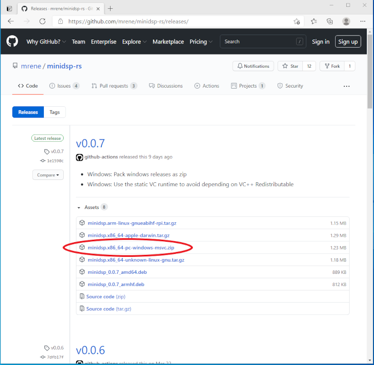

2\. Decompress the downloaded minidsp-rs file using Windows Explorer, or your favorite decompression utility. Right-click on the file, and select "Extract All...".


Update the destination to the user's home folder (just remove the Downloads.... portion), and click Extract.


NOTE - If the file was not downloaded to the user's Downloads directory, or you want the file in a different directory, please modify accordingly.

3\. To confirm basic functionality, open a Command Prompt.

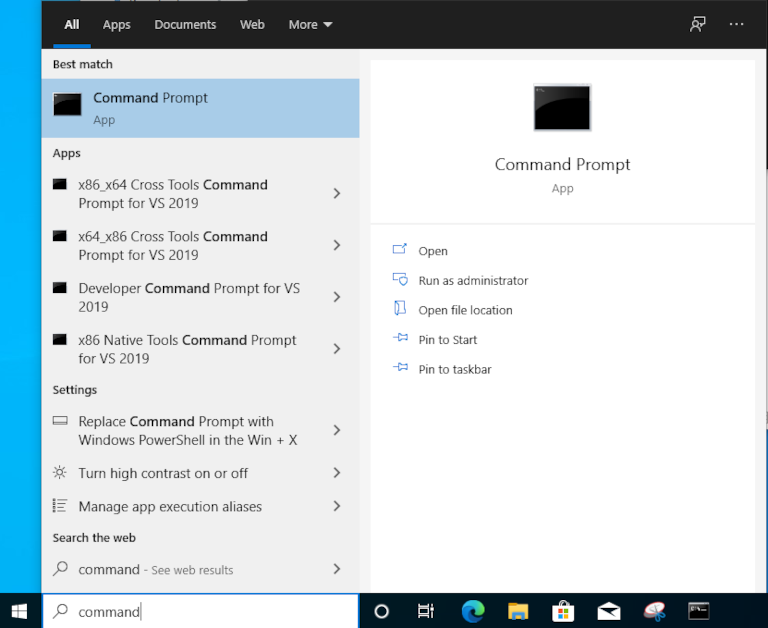

4\. In the Command Prompt window, type: `minidsp`

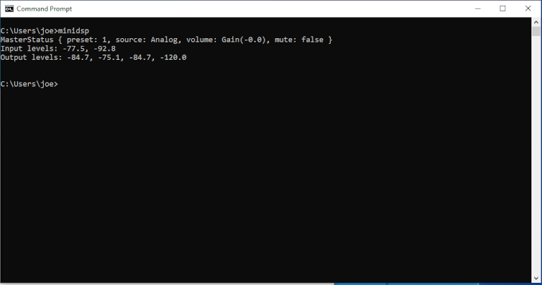

5\. If the MiniDSP 2x4HD is connected properly, similar information to the screenshot above will be displayed. Note the "preset: 1" in the image. That indicates that the MiniDSP 2x4HD is set to Config slot 2. The minidsp-rs application starts at 0 for the config presets, so 0 = Config slot 1, and so on.

6\. If the MiniDSP 2x4HD is not detected, or is not connected, the following error will appear.
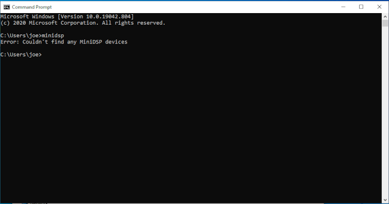

### Download and verify ezbeq
ezbeq is a web application which uses minisdsp-rs installed earlier to send the BEQ filters to an attached MiniDSP 2x4HD. 

1\. Open a browser and navigate to [https://github.com/3ll3d00d/ezbeq/releases](https://github.com/3ll3d00d/ezbeq/releases). Select a version and click the "ezbeq.exe" link. 


2\. If using Microsoft Edge, the file may be blocked by default. To proceed, select the "See more" option to finish the download. 


Click on "Keep"


Click "Keep Anyway"


3\. Copy the downloaded file to the same location (User home directory) as the minidsp.exe file. After copying, both the ezbeq.exe and minidsp.exe files should be in the location.


4\. Modifications to the ezbeq configuration file are required, but the file is not created until it is executed for the first time. Navigate to the home directory, and launch ezbeq by double-clicking on the ezbeq executable file. On some versions of Windows, this will generate a Microsoft Defender error message like below.


5\. If the Defender message is seen, click on "More info", and then "Run anyway".


6\. Windows Defender firewall may also prompt to select which networks to allow ezbeq to communicate with. Typically, select "Private networks, such as my home or work network", and then click "Allow access".


7\. If a Command Prompt opens and then closes quickly, the VC++ Redistributable is probably not installed. 

Download the current VC++ redist file from Microsoft:
- 64 bit (most users): [https://aka.ms/vs/16/release/VC_redist.x64.exe](https://aka.ms/vs/16/release/VC_redist.x64.exe)
- 32 bit (very old systems): [https://aka.ms/vs/16/release/VC_redist.x86.exe](https://aka.ms/vs/16/release/VC_redist.x86.exe)

Run the installer. When complete, re-launch ezbeq, which should now open a Command prompt window and stay running.

8\. Close the Command prompt window in which ezbeq is running.

9\. Navigate to the user home folder, and then double-click on the newly created .ezbeq folder.


10\. Double-click on the ezbeq.yml file.

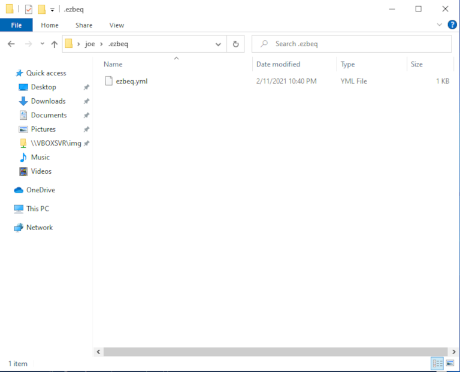

11\. Double-click on the file, click More Apps, choosing Notepad to open the file (or the preferred text editor).


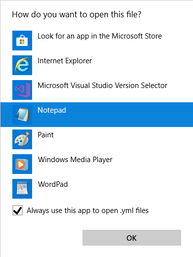

12\. Initial configuration file example

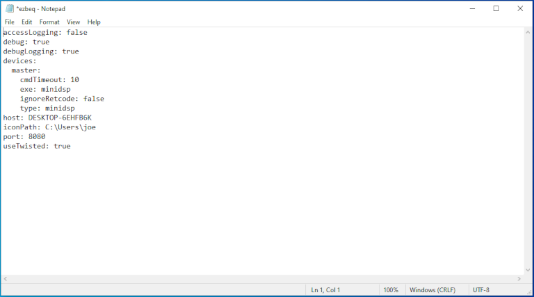

13\. Host will be the name of the system. Change the "minidspExe" line to the location where the minidsp.exe was placed initially. Save the file.

NOTE: Ensure that .exe is added to the end as well, or it won't work correctly.


14\. Return to the Windows File Explorer window, and double-click on the ezbeq.exe file again. This will open a command prompt and the application will be running.


15\. ezbeq runs on port 8080 of the system by default. Open a web browser and connect to the system on port 8080. Note that the web server is not encrypted, so the URL must be entered as http, otherwise most current browsers will automatically try to connect using HTTPS (secured) and fail.

Open a browser window to `http://127.0.0.1:8080`

(127.0.0.1 is a special reference to the local machine. If the server running ezbeq is remote, enter the IP of it instead of 127.0.0.1.)


16\. Verify that an asterisk (\*) is next to one of the slot numbers (1-4). This indicates that ezbeq was able to read the active config slot from the MiniDSP, and that everything is ready to go.

Once ezbeq is installed, it can be run manually from a Command Prompt or Powershell (`C:\Users\<userid>\ezbeq.exe`), double-click on the executable, or continue to the next section to start ezbeq automatically upon system boot.

Please refer to the User Guide for more information on how to use ezbeq.

### Automatically launch ezbeq on boot

These steps are optional but are highly recommended. If these steps are not followed, ezbeq will need to be started manually after every reboot of the Windows device, or if the Powershell/Command Prompt window is closed.

1\. Open Task Scheduler


2\. Click on Create Task...


3\. Enter the name for the task (such as "ezbeq"), and select the "Run whether user is logged on or not" option.


4\. Click on the Triggers tab. Click "New..." button. Select "At startup" from the drop down list, click OK.

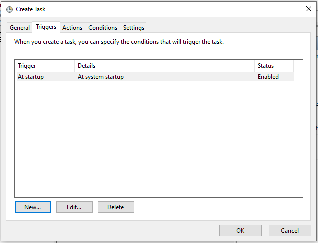

5\. Click on the Actions tab. Click "New..." button. In the Program/script field, enter the full path to the ezbeq.exe file, or navigate through the folders by clicking the "Browse..." button. Then click OK.

If it has been installed following these directions, the path should be: `C:\Users\<userid>\ezbeq.exe` (replacing userID with the correct ID).


6\.Click OK, which then prompts for the user's password. This should be the password for the account under which the application has been installed.


7\. The main Task Scheduler should appear, and the new task should be visible.


8\. Reboot the Windows device to find out if the service restarts properly, or highlight the ezbeq task, and click the "Run" icon to start it right away.

NOTE - If ezbeq is still running in a Powershell/Command Prompt window, please stop it before attempting to run the task, or it will error out.

9\. After the device reboots, ezbeq should be available. 


### Updating minidsp-rs

Updating minidsp-rs is the exact same process as above, with a new version of the file. Save a backup copy of the currently used version, then download, decompress, and place it in the same location as the old version (overwriting the old one).

### Updating ezbeq

To update ezbeq, download the new version and follow the steps earlier in this document. Overwrite the existing version with the new one. 

1\. If ezbeq is running, it needs to be stopped or else the upgrade will fail. If it is running manually in a Powershell/Command Prompt window, Ctrl-C to stop it, or just close the Powershell window. Skip to step #6.

2\. If ezbeq was set to run automatically on boot, open Task Scheduler and select "Display All Running Tasks".

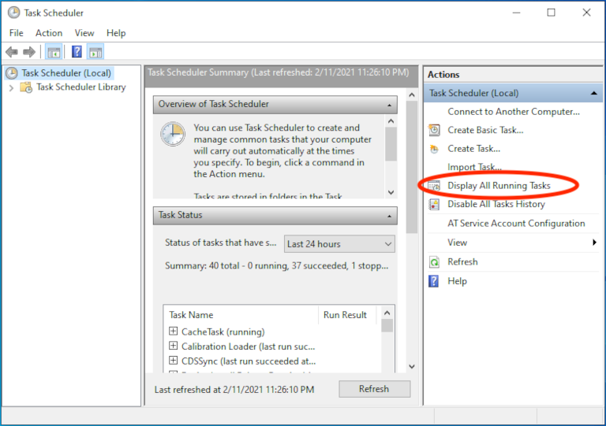

3\. Select ezbeq and click "End Task".


4\. Select "Yes" to end the selected task.


5\. Verify the ezbeq task is no longer listed, and close task scheduler windows.

6\. Download the new version from github.com.

7\. Follow the previous steps to install. Be sure to overwrite the existing ezbeq.exe with the new one.

8\. Re-launch ezbeq as above (`C:\<UserID>\ezbeq.exe`), or if it is configured to launch on boot, reboot the device.

## Advanced configuration option (Server mode)

minidsp-rs can be run in "server mode", which makes it run all of the time in the background. In this configuration, it allows the proprietary MiniDSP application, the MiniDSP Android App, and ezbeq to all connect to the MiniDSP hardware. It can basically act like a Wi-Dg and provide access to the MiniDSP hardware over the network.

When run in this mode, the ezbeq configuration file must be modified as well.

### Configure minidsp-rs to run in server mode

1\. Open Task Scheduler


2\. Click on Create Task...


3\. Enter the name for the task (such as "minidsp"), and select the "Run whether user is logged on or not" option.


4\. Click on the Triggers tab. Click "New..." button. Select "At startup" from the drop down list, click OK.


5\. Click on the Actions tab. Click "New..." button. In the Program/script field, enter the full path to the minidsp.exe file, or navigate through the folders by clicking the "Browse..." button. In the "Add arguments (optional)" field, enter `server`. Then click OK.

If it has been installed following these directions, the path should be: `C:\Users\<userid>\minidsp.exe` (replacing userID with the correct ID).

Note - The "server" keyword is extremely important.

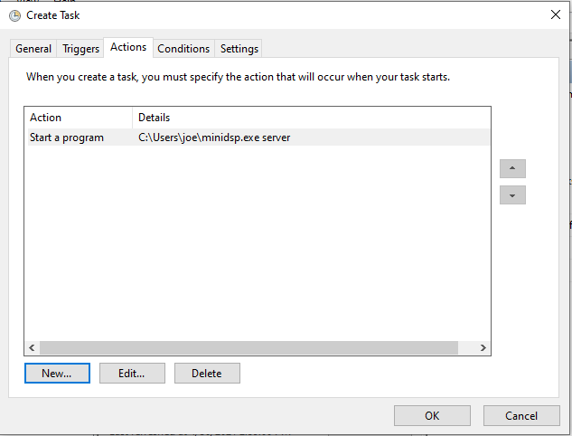

6\.Click OK, which then prompts for the user's password. This should be the password for the account under which the application has been installed.


7\. The main Task Scheduler should appear, and the new task should be visible.

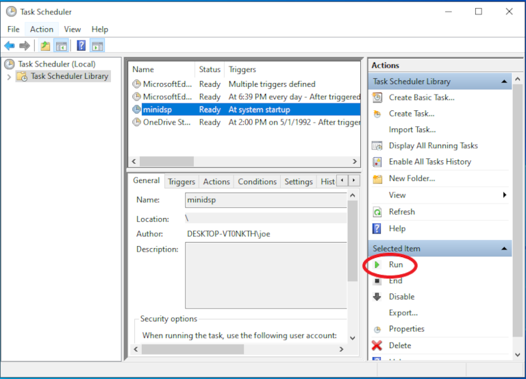

8\. Reboot the Windows device to find out if the service restarts properly, or highlight the minidsp task, and click the "Run" icon to start it right away.


### Update ezbeq config

Now that minidsp-rs is running in server mode, the ezbeq configuration needs to be updated to add the "--tcp" option when it calls minidsp-rs, as only one instance of minidsp-rs can be communicating with the USB connected hardware at a time.

1\. Navigate to the user home folder, and then double-click on the `.ezbeq` folder.


2\. Double-click on the `ezbeq.yml` file to open it in notepad or the preferred text editor.

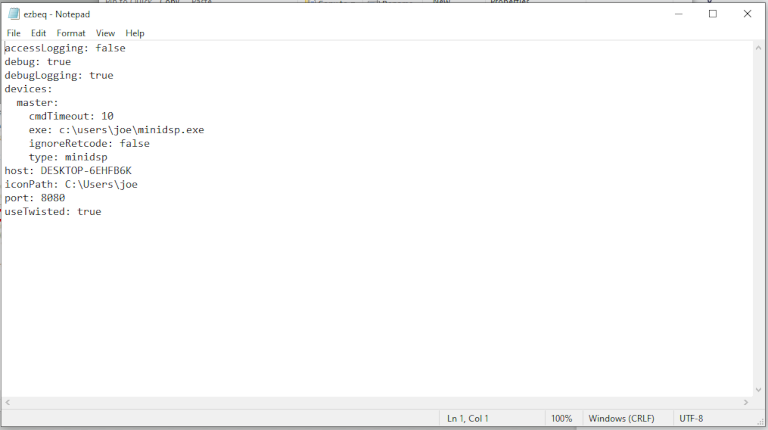

3\. Add the following line and then Save the file.

```
minidspOptions: --tcp 127.0.0.1
```

NOTE: This configuration assumes that minidsp-rs and ezbeq are running on the same system. If minidsp-rs is running in server mode on a separate device, then enter the IP address of the remote system.

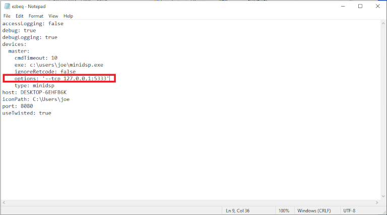

4\. Restart ezbeq (if ezbeq is automatically running at startup, reboot the machine, or open the task scheduler, find the ezbeq task, and stop it, then start it).

5\. Load the ezbeq webpage from a browser, and validate that it is working properly.

### Using the Official MiniDSP App(s)

At this point, with minidsp-rs running in server mode, the official MiniDSP plugin (app) can also be used. Assuming it is being run from a different machine, enter the IP address of the minidsp-rs server in the IP field of the application. Note that the automatic detection of the IP does not usually work, so the IP needs to be entered manually.

The official MiniDSP Android and iOS applications will also work in this manner (manually entering the IP address of the minidsp-rs server instance).

This allows for the official applications to work in conjunction with ezbeq, without needing to move the USB connection to different devices.

Note - Do NOT have the official MiniDSP plugin in Connected state at the same time as trying to use ezbeq. It will typically generate an ERROR.

Reminder - ezbeq applies BEQ settings to the INPUT side of the MiniDSP. Any house settings (house curve, crossovers, etc) should be applied on the OUTPUT side.

## Troubleshooting

If attempting to access the site from a remote computer (still on the same internal network) and it is not working, but works when logged in locally, verify that the network is configured as "private", and not "public".

Right click on the Network icon and select Open Network & Internet settings. Click Properties, and choose Private network.


## A few other notes

Bear in mind that, so far, settings cannot be read back from the MiniDSP 2x4HD. This means that no applications are able to show your currently loaded configs, including the official plugin. The official plugin handles this by detecting a change to the local data and forcing that down to the MiniDSP. It may be worth periodically reloading any custom EQ&#39;s on all output channels and clearing all inputs.
